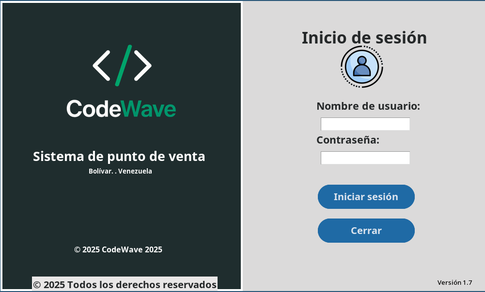
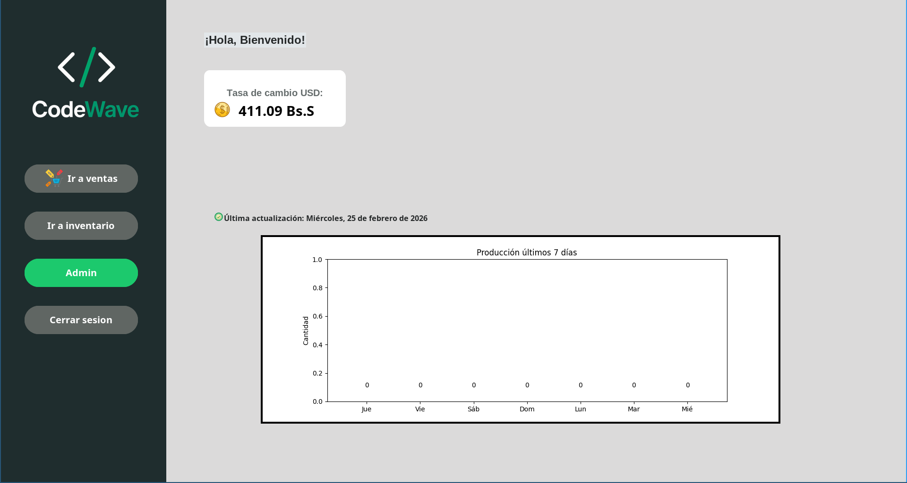
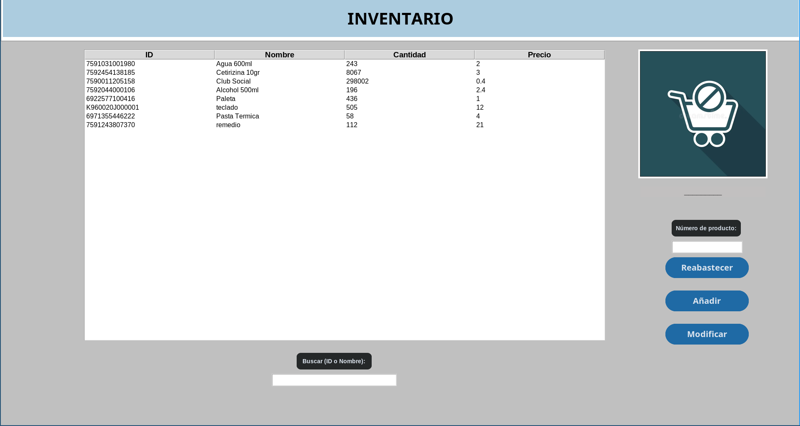
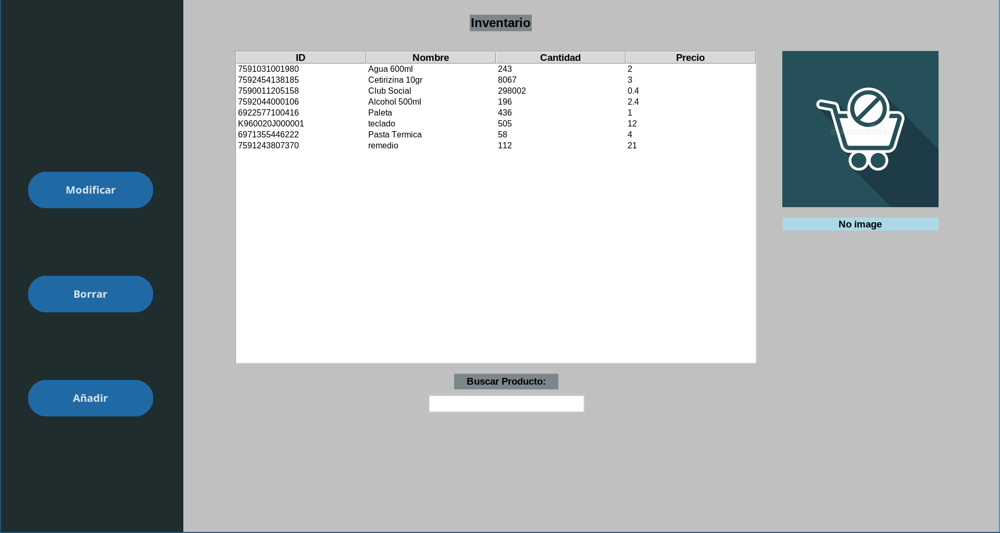

# Punto de Venta (Desktop POS)

## Preview

## Overview | Descripción
| English | Español |
| --- | --- |
| - Desktop point-of-sale built with Tkinter/CustomTkinter on SQLite (`database_ventas.db`). - Role-based access: standard users and admins (admins see the admin inventory view and get a welcome notice). - Live USD rate from BCV via `pyBCV`; shows prices/totals in Bs while storing USD in DB. | - Sistema de punto de venta de escritorio con Tkinter/CustomTkinter y SQLite (`database_ventas.db`). - Acceso por roles: usuarios y administradores (los admins ven el inventario de administración y reciben aviso de bienvenida). - Toma la tasa USD del BCV con `pyBCV`; muestra precios/totales en Bs mientras guarda USD en la base. |

## Features | Funcionalidades
| English | Español |
| --- | --- |
| **Login & roles** - Sample users: `admin/papo`, `Alejandro/cafe123`, `Danito/Danito`. - Admins unlock the admin inventory view. | **Login y roles** - Usuarios de ejemplo: `admin/papo`, `Alejandro/cafe123`, `Danito/Danito`. - Los admins habilitan la vista de inventario admin. |
| **Home hub** - Buttons to Sales, Inventory, Admin Inventory, Logout. - USD rate tile with last-update label. | **Panel principal** - Botones a Ventas, Inventario, Inventario Admin, Cerrar sesión. - Tarjeta de tasa USD y etiqueta de última actualización. |
| **Weekly production chart** - Matplotlib bar chart for the last 7 days of sales quantities (`ventas.fecha`). | **Gráfico semanal** - Barras de los últimos 7 días con cantidades vendidas (`ventas.fecha`). |
| **Sales (Ventas)** - Search with live suggestions by ID or name; Enter adds qty=1. - Prices/totals shown in Bs (USD price x `usd_rate`). - Stock validation and decrement on payment. - Auto-incremented invoice numbers. - Running total, clock widget, focus on search at open. - Invoice viewer (loads `ventas`, shows amounts in Bs). - Password-protected receipt PDF (default `recibo` or `recibo/password`). - Migrate sales to `cierre` with password; clears `ventas` after migration. | **Ventas (Ventas)** - Búsqueda con sugerencias por ID o nombre; Enter agrega cantidad=1. - Precios/totales en Bs (precio USD x `usd_rate`). - Valida stock y descuenta al cobrar. - Numeración de factura auto-incremental. - Total en pantalla, reloj, foco inicial en búsqueda. - Visor de facturas (lee `ventas`, muestra montos en Bs). - Recibo PDF protegido (clave `recibo` o `recibo/password`). - Migrar ventas a `cierre` con contraseña; limpia `ventas` después. |
| **Inventory (Inventario)** - List/search by ID or name; restock, add, modify, delete. - Product image support (`imagenes_productos/<id>.jpg`) with preview; fallback `null.webp`. - Stock/price changes persist to SQLite; ensures `inventario` exists on startup. | **Inventario (Inventario)** - Lista/búsqueda por ID o nombre; reabastecer, añadir, modificar, borrar. - Soporta imagen (`imagenes_productos/<id>.jpg`) con vista previa; respaldo `null.webp`. - Cambios de stock/precio persisten en SQLite; asegura `inventario` al iniciar. |
| **Admin Inventory (Inventario_Admin)** - Admin-only view with search, add, modify (dedicated window), delete, and preview. | **Inventario Admin (Inventario_Admin)** - Vista solo admin con búsqueda, añadir, modificar (ventana dedicada), borrar y vista previa. |
| **Receipts & closure** - `mover_cierre.py` groups `ventas` into `cierre` (by product and price), sums quantities, recalculates subtotals, then empties `ventas`. - `generar_recibo_cierre.py` builds PDF from `cierre` and saves under Documents `recibos/<date>/`. | **Recibos y cierre** - `mover_cierre.py` agrupa `ventas` en `cierre` (por producto y precio), suma cantidades, recalcula subtotales y limpia `ventas`. - `generar_recibo_cierre.py` crea PDF desde `cierre` y lo guarda en Documentos `recibos/<fecha>/`. |
| **UI helpers** - Custom buttons (`ctk_button.make_ctk_button`) and rounded fallback buttons (`widgets.py`). | **Utilidades UI** - Botones personalizados (`ctk_button.make_ctk_button`) y botones redondeados de respaldo (`widgets.py`). |

## Dependencies | Dependencias
| English | Español |
| --- | --- |
| - Python 3.10+ (with `tkinter`/`python3-tk`). - Pip packages: `customtkinter`, `Pillow`, `matplotlib`, `pyBCV`, `fpdf`, `streamlit`. - Built-ins: `sqlite3`, `tkinter`, `webbrowser`, `os`, `datetime`. | - Python 3.10+ (con `tkinter`/`python3-tk`). - Paquetes pip: `customtkinter`, `Pillow`, `matplotlib`, `pyBCV`, `fpdf`, `streamlit`. - Incluidos: `sqlite3`, `tkinter`, `webbrowser`, `os`, `datetime`. |

## Setup | Instalación
| English | Español |
| --- | --- |
| - `python -m venv .venv` - `source .venv/bin/activate` (Windows: `.venv\\Scripts\\activate`) - `pip install --upgrade pip` - `pip install customtkinter Pillow matplotlib pyBCV fpdf streamlit` - If `tkinter` is missing on Linux: `sudo apt-get install python3-tk`. | - `python -m venv .venv` - `source .venv/bin/activate` (Windows: `.venv\\Scripts\\activate`) - `pip install --upgrade pip` - `pip install customtkinter Pillow matplotlib pyBCV fpdf streamlit` - Si falta `tkinter` en Linux: `sudo apt-get install python3-tk`. |

## Running | Ejecución
| English | Español |
| --- | --- |
| - `python index.py` - Window adapts to your screen; dark-accent theme. - SQLite tables auto-create on first run. | - `python index.py` - Ventana se adapta a tu pantalla; tema oscuro. - Las tablas SQLite se crean en el primer inicio. |

## Data & credentials | Datos y credenciales
| English | Español |
| --- | --- |
| - Database: `database_ventas.db` in repo root. - Tables: `inventario`, `ventas`, `cierre` (created on first migration). - Sample credentials: `admin/papo`, `Alejandro/cafe123`, `Danito/Danito` (admins: `admin`, `Danito`). | - Base: `database_ventas.db` en la raíz. - Tablas: `inventario`, `ventas`, `cierre` (se crea en la primera migración). - Credenciales de ejemplo: `admin/papo`, `Alejandro/cafe123`, `Danito/Danito` (admins: `admin`, `Danito`). |

## Receipts & passwords | Recibos y contraseñas
| English | Español |
| --- | --- |
| - Sales receipts need a password: default `recibo`, or override with `recibo/password` file. - Closure receipts read company info from `recibo/` (`logo.pnj`, `nombre_empresa`, `rif`, `Ubicacion_empresa`). | - Los recibos de Ventas piden contraseña: por defecto `recibo`, o define otra en `recibo/password`. - Los recibos de cierre leen datos de empresa desde `recibo/` (`logo.pnj`, `nombre_empresa`, `rif`, `Ubicacion_empresa`). |

## Project layout | Estructura
| English | Español |
| --- | --- |
| - `index.py` – launches login. - `inicio.py` – login window, role flag. - `manager.py` – main window host. - `container.py` – home hub, USD tile, chart, navigation. - `ventas.py` – sales UI, stock, invoicing, receipts, migration. - `inventario.py` – inventory CRUD/restock with images. - `inventario_admin.py` – admin inventory view. - `conexion.py` – SQLite helpers and initialization. - `recibo.py`, `generar_recibo_cierre.py`, `mover_cierre.py` – PDFs and closing. - `imagenes_productos/` – product images; `imagenes/` – UI assets. | - `index.py` – arranque del login. - `inicio.py` – ventana de login y rol. - `manager.py` – ventana principal. - `container.py` – panel inicial, tasa USD, gráfico, navegación. - `ventas.py` – UI de ventas, stock, facturación, recibos, migración. - `inventario.py` – CRUD/reabastecer inventario con imágenes. - `inventario_admin.py` – vista de inventario para admins. - `conexion.py` – helpers SQLite e inicialización. - `recibo.py`, `generar_recibo_cierre.py`, `mover_cierre.py` – PDFs y cierre. - `imagenes_productos/` – imágenes de productos; `imagenes/` – recursos de UI. |

## Tests | Pruebas
| English | Español |
| --- | --- |
| - `test_ctk.py` (button helper). - `test_recibo_save.py` (receipt saving). - Run: `python -m pytest` (install `pytest` if needed). | - `test_ctk.py` (botones). - `test_recibo_save.py` (guardado de recibos). - Ejecuta: `python -m pytest` (instala `pytest` si hace falta). |

## License | Licencia
| English | Español |
| --- | --- |
| - Apache 2.0 (`LICENSE`). | - Apache 2.0 (`LICENSE`). |
